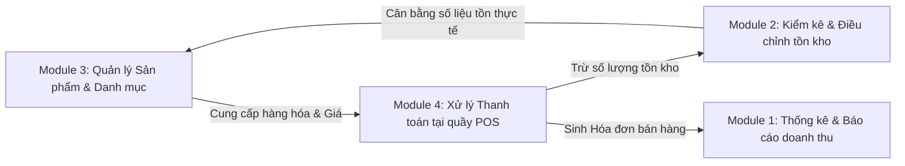

# HỆ THỐNG QUẢN LÝ CHUỖI SIÊU THỊ MINI ANNA (ANNA MART)
## TÀI LIỆU KỸ THUẬT, KIẾN TRÚC PHÂN RÃ & QUY CHUẨN LÀM VIỆC NHÓM
### BÀI TẬP LỚN: PHÂN TÍCH VÀ THIẾT KẾ HỆ THỐNG THÔNG TIN (PTTKHTTT - PTIT)

> **Tài liệu nội bộ dành riêng cho các thành viên trong nhóm:**  
> Tài liệu này chuẩn hóa toàn bộ công nghệ, quy định các thành phần **DÙNG CHUNG (Shared Resources)**, cấu trúc thư mục phân rã cho **4 module chính**, chuẩn giao tiếp API và quy ước Git. Các thành viên bắt buộc đọc kỹ và tuân thủ để quá trình lập trình song song **không bị xung đột mã nguồn, không đè API, không sai lệch kiểu dữ liệu CSDL** và dễ dàng ghép nối thành một hệ thống hoàn chỉnh.

---

## 1. TỔNG QUAN 4 MODULE BÀI TẬP LỚN CỦA NHÓM

Hệ thống tập trung hiện thực hóa 4 phân hệ nghiệp vụ cốt lõi của Chuỗi Siêu thị Mini Anna:



1. **Module 1: Thống kê và báo cáo doanh thu theo kỳ** *(Đã hoàn thành)*
   - *Chức năng*: Lọc doanh thu theo ngày/tháng/chi nhánh, đo lường KPI, biểu đồ trực quan (Line/Doughnut/Bar Chart), danh sách hóa đơn chi tiết và xuất file Excel đối soát.
2. **Module 2: Kiểm kê và điều chỉnh hàng tồn kho**
   - *Chức năng*: Tạo phiếu kiểm kê, so khớp số lượng tồn trên hệ thống với số lượng thực tế đếm tại quầy, tính toán chênh lệch (thừa/thiếu), ghi nhận lý do và thực hiện cân bằng (điều chỉnh) lại số lượng tồn kho.
3. **Module 3: Cập nhật thông tin và danh mục sản phẩm kinh doanh**
   - *Chức năng*: Quản lý danh mục hàng hóa (Thực phẩm, Đồ uống, Hóa mỹ phẩm,...), thêm mới sản phẩm, cập nhật giá bán, giá nhập, đơn vị tính, trạng thái kinh doanh (ngừng bán/đang bán).
4. **Module 4: Xử lý thanh toán tại quầy (POS - Bán lẻ)**
   - *Chức năng*: Thu ngân chọn/quét mã sản phẩm, nhập số lượng, tự động tính tổng tiền, áp dụng mã giảm giá, chọn phương thức thanh toán (Tiền mặt / QR Chuyển khoản / Thẻ ATM), in/lưu hóa đơn và tự động trừ số lượng tồn kho của sản phẩm tương ứng.

---

## 2. NGĂN XẾP CÔNG NGHỆ BẮT BUỘC (TECH STACK)

Mọi thành viên trong nhóm phải chạy chung một chuẩn môi trường:

| Thành phần | Công nghệ quy chuẩn | Phiên bản khuyến nghị | Lưu ý quan trọng |
| :--- | :--- | :--- | :--- |
| **Runtime** | **Node.js** | `>= 18.x` (khuyến nghị `20.x` hoặc `24.x`) | Kiểm tra: `node -v` |
| **Package Manager**| **NPM** | `>= 9.x` (khuyến nghị `10.x` hoặc `11.x`) | Kiểm tra: `npm -v` |
| **Backend Framework**| **Express.js** | `^4.21.x` | Tuân thủ mô hình 3 lớp Boundary - Control - Entity |
| **Cơ sở dữ liệu**| **MySQL / MariaDB (XAMPP)**| MySQL `>= 8.0` hoặc MariaDB `10.4.x` | Chạy tại Port `3306` |
| **Thư viện xuất Excel**| **exceljs** | `^4.4.x` | Xuất báo cáo doanh thu & báo cáo kiểm kê kho |
| **Frontend UI** | **HTML5 + CSS3 + JavaScript (ES6+)** | Chạy trực tiếp trên trình duyệt | Thư viện biểu đồ: **Chart.js v4.x** qua CDN |

---

## 3. CÁC THÀNH PHẦN DÙNG CHUNG (SHARED RESOURCES)

Để tránh việc mỗi thành viên tự viết lại code hoặc gây mâu thuẫn hệ thống, các thành phần sau đây **ĐÃ ĐƯỢC XÂY DỰNG SẴN VÀ DÙNG CHUNG**:

### 3.1. Dùng chung Cơ sở dữ liệu (`database/schema.sql`)
- CSDL duy nhất tên: **`sieuthi_anna`** (bộ mã `utf8mb4_unicode_ci`).
- Tất cả các bảng đã được thiết kế liên kết khóa ngoại chặt chẽ:
  - `tbl_cuahang`: Danh sách chi nhánh (Cầu Giấy, Hà Đông, Hai Bà Trưng).
  - `tbl_nhanvien`: Tài khoản thu ngân & quản trị viên.
  - `tbl_danhmuc`: Danh mục nhóm hàng *(Dùng chung cho Module 1, 3, 4)*.
  - `tbl_sanpham`: Thông tin sản phẩm, đơn giá và **`so_luong_ton`** *(Dùng chung cho cả 4 Module)*.
  - `tbl_hoadon`: Hóa đơn bán hàng *(Module 4 ghi $\rightarrow$ Module 1 đọc)*.
  - `tbl_chitiethoadon`: Chi tiết từng dòng hàng bán *(Module 4 ghi $\rightarrow$ Module 1 đọc)*.
  - `tbl_phieukiemke` & `tbl_chitietkiemke`: Phiếu kiểm kho *(Module 2 xử lý)*.

> [!IMPORTANT]
> **Quy tắc CSDL**: Không thành viên nào được tự ý đổi tên cột hoặc xóa bảng trong `schema.sql`. Nếu cần bổ sung trường mới, phải báo trưởng nhóm để cập nhật đồng bộ cho cả nhóm.

### 3.2. Dùng chung Quản lý Kết nối CSDL (`src/db.js`)
- Tệp `src/db.js` cung cấp **MySQL Connection Pool**.
- **Cơ chế Fallback thông minh**: Khi một thành viên chưa bật XAMPP MySQL, hệ thống tự động kích hoạt bộ đệm dữ liệu mẫu (Mock DB) nên vẫn có thể code và test giao diện bình thường mà không bị crash server.
- Cách sử dụng trong Model:
  ```javascript
  const { getPool, isMySQLConnected } = require('../db');
  // const pool = getPool();
  ```

### 3.3. Dùng chung Server & Middleware (`src/server.js`)
- Cổng chạy duy nhất: **`http://localhost:3000`**.
- Đã tích hợp sẵn middleware phân tích JSON (`express.json()`), CORS, và phục vụ thư mục giao diện tĩnh (`public/`).
- Các thành viên chỉ việc **đăng ký router của module mình** vào `server.js` theo tiền tố đã phân công.

### 3.4. Dùng chung Các Lớp Thực thể (Shared Entity Models)
- **`src/models/SanPham.js`**:
  - Module 3 dùng để: `getAll()`, `create()`, `update()`, `delete()`.
  - Module 4 (POS) dùng để: `searchByNameOrBarcode()`, `updateStockAfterCheckout(id, quantity)`.
  - Module 2 (Kho) dùng để: `getInventoryList()`, `adjustStock(id, newQuantity)`.
  - Module 1 (Báo cáo) dùng để: `getTopSellingProducts()`.
- **`src/models/HoaDon.js`**:
  - Module 4 dùng để: `createInvoiceWithDetails(invoiceData, items)`.
  - Module 1 dùng để: `getOverview()`, `getTimelineData()`, `getInvoiceList()`.

### 3.5. Dùng chung Hệ thống Giao diện & Design System (`public/style.css`)
- File `public/style.css` đã chứa đầy đủ:
  - Hệ màu chuẩn quản trị (Primary Blue, Success Green, Warning Orange, Slate Background).
  - Sidebar Menu điều hướng chung cho cả 4 module.
  - Các class component chuẩn: `.btn`, `.btn-primary`, `.btn-export`, `.form-control`, `.card`, `.data-table`, `.badge-status`, `.modal`.
  - Thành viên làm giao diện các module sau chỉ cần kế thừa CSS này, không cần viết lại CSS từ đầu.

---

## 4. CẤU TRÚC THƯ MỤC CHI TIẾT CHO 4 MODULE (CHUẨN 3 LỚP PTIT)

```
BTL/
├── database/
│   └── schema.sql                  # [DÙNG CHUNG] Script CSDL hoàn chỉnh cho cả 4 module
├── CHƯƠNG_1.MD                     # [BÁO CÁO] Chương 1 đã hoàn thiện
├── PLAN.MD                         # [KẾ HOẠCH] Đề cương tổng thể đồ án
├── README.MD                       # [HƯỚNG DẪN] File tài liệu này
└── app/
    ├── package.json                # [DÙNG CHUNG] Quản lý dependencies (express, mysql2, exceljs, cors)
    │
    ├── public/                     # === TẦNG GIAO DIỆN CLIENT (BOUNDARY UI) ===
    │   ├── style.css               # [DÙNG CHUNG] Bộ giao diện, màu sắc, bảng, nút bấm
    │   │
    │   │── index.html              # [MODULE 1] Giao diện Thống kê & Báo cáo doanh thu
    │   │── app.js                  # [MODULE 1] Logic vẽ biểu đồ Chart.js & bộ lọc doanh thu
    │   │
    │   │── inventory.html          # [MODULE 2] Giao diện Phiếu kiểm kê & Điều chỉnh kho
    │   │── inventory.js            # [MODULE 2] Logic tạo phiếu kiểm, đếm hàng, cân bằng kho
    │   │
    │   │── products.html           # [MODULE 3] Giao diện Quản lý Sản phẩm & Danh mục
    │   │── products.js             # [MODULE 3] Logic CRUD sản phẩm, chọn danh mục, cập nhật giá
    │   │
    │   │── pos.html                # [MODULE 4] Giao diện Màn hình Thu ngân bán hàng tại quầy
    │   └── pos.js                  # [MODULE 4] Logic giỏ hàng, tính tiền, chọn phương thức TT
    │
    └── src/
        ├── db.js                   # [DÙNG CHUNG] Kết nối MySQL & Fallback Mock Data
        ├── server.js               # [DÙNG CHUNG] File khởi chạy server trung tâm
        │
        ├── routes/                 # === TẦNG ĐỊNH TUYẾN BIÊN (BOUNDARY API) ===
        │   ├── revenueRoutes.js    # [MODULE 1] URL prefix: /api/revenue
        │   ├── inventoryRoutes.js  # [MODULE 2] URL prefix: /api/inventory
        │   ├── productRoutes.js    # [MODULE 3] URL prefix: /api/products và /api/categories
        │   └── posRoutes.js        # [MODULE 4] URL prefix: /api/pos
        │
        ├── controllers/            # === TẦNG ĐIỀU KHIỂN NGHIỆP VỤ (CONTROL LAYER) ===
        │   ├── DoanhThuController.js   # [MODULE 1] Tính toán doanh thu, xuất Excel
        │   ├── KiemKeController.js     # [MODULE 2] Xử lý logic lập phiếu kiểm & điều chỉnh tồn
        │   ├── SanPhamController.js    # [MODULE 3] Xử lý nghiệp vụ thêm/sửa/xóa sản phẩm
        │   └── BanHangController.js    # [MODULE 4] Xử lý tạo hóa đơn thanh toán & trừ kho
        │
        └── models/                 # === TẦNG THỰC THỂ DỮ LIỆU (ENTITY LAYER) ===
            ├── HoaDon.js           # [DÙNG CHUNG M1 & M4] Thực thể tbl_hoadon, tbl_chitiethoadon
            ├── SanPham.js          # [DÙNG CHUNG M1, M2, M3, M4] Thực thể tbl_sanpham
            ├── DanhMuc.js          # [DÙNG CHUNG M1, M3, M4] Thực thể tbl_danhmuc
            └── PhieuKiemKe.js      # [MODULE 2] Thực thể tbl_phieukiemke, tbl_chitietkiemke
```

---

## 5. BẢNG PHÂN CHIA API & QUY ƯỚC TRÁNH XUNG ĐỘT

Để các thành viên lập trình song song mà không bị trùng lặp URL:

### 5.1. Module 1: Thống kê và Báo cáo Doanh thu (Prefix: `/api/revenue`)
- `GET /api/revenue/overview?fromDate=&toDate=&storeId=`: Các chỉ số KPI tổng hợp.
- `GET /api/revenue/timeline?fromDate=&toDate=&storeId=`: Dữ liệu vẽ biểu đồ đường theo ngày.
- `GET /api/revenue/top-products?limit=5`: Top sản phẩm bán chạy nhất.
- `GET /api/revenue/category-breakdown`: Tỷ trọng doanh thu theo danh mục hàng hóa.
- `GET /api/revenue/invoices?fromDate=&toDate=&storeId=`: Danh sách hóa đơn chi tiết.
- `GET /api/revenue/export-excel`: Tải file Excel báo cáo doanh thu.

### 5.2. Module 2: Kiểm kê và Điều chỉnh Hàng tồn kho (Prefix: `/api/inventory`)
- `GET /api/inventory/current-stock`: Lấy danh sách sản phẩm cùng số lượng tồn hiện tại trên hệ thống.
- `POST /api/inventory/audit-sheets`: Tạo phiếu kiểm kê mới (lưu ngày kiểm, nhân viên kiểm, cửa hàng).
- `POST /api/inventory/audit-sheets/:id/items`: Thêm danh sách mặt hàng thực tế đếm được vào phiếu.
- `POST /api/inventory/audit-sheets/:id/balance`: **Cân bằng tồn kho** (tự động cập nhật `so_luong_ton` trong `tbl_sanpham` theo số lượng thực tế kiểm kê và đóng phiếu).
- `GET /api/inventory/audit-sheets`: Lịch sử các lần kiểm kê trước đó.

### 5.3. Module 3: Cập nhật Thông tin & Danh mục Sản phẩm (Prefix: `/api/products` & `/api/categories`)
- `GET /api/products`: Danh sách tất cả sản phẩm (hỗ trợ phân trang, tìm kiếm theo tên/mã).
- `POST /api/products`: Thêm mới một mặt hàng kinh doanh.
- `PUT /api/products/:id`: Cập nhật thông tin (tên, giá nhập, giá bán, danh mục, đơn vị tính).
- `DELETE /api/products/:id`: Xóa hoặc đổi trạng thái ngừng kinh doanh (`trang_thai = 0`).
- `GET /api/categories`: Lấy danh sách các danh mục nhóm hàng.
- `POST /api/categories`: Thêm mới danh mục nhóm hàng.

### 5.4. Module 4: Xử lý Thanh toán tại quầy (Prefix: `/api/pos`)
- `GET /api/pos/search-products?keyword=`: Tìm kiếm nhanh sản phẩm theo tên hoặc mã SP để thêm vào đơn hàng.
- `POST /api/pos/checkout`: Thực hiện thanh toán đơn hàng:
  - Tạo bản ghi trong `tbl_hoadon`.
  - Tạo các bản ghi trong `tbl_chitiethoadon`.
  - **Tự động trừ `so_luong_ton`** trong `tbl_sanpham` tương ứng với số lượng mua.
- `GET /api/pos/invoices/:id/print`: Lấy dữ liệu phiếu thanh toán để in hóa đơn bán lẻ cho khách.

---

## 6. HƯỚNG DẪN CÀI ĐẶT & CHẠY DỰ ÁN CHO THÀNH VIÊN MỚI

Khi bạn pull code mới nhất từ kho lưu trữ về máy:

### Bước 1: Di chuyển vào thư mục code
```powershell
cd BTL/app
```

### Bước 2: Cài đặt thư viện phụ thuộc
```powershell
npm install
```

### Bước 3: Khởi động CSDL
- Mở **XAMPP Control Panel** $\rightarrow$ Start **MySQL**.
- Mở trình duyệt vào `http://localhost/phpmyadmin`, tạo CSDL `sieuthi_anna` và Import tệp `BTL/database/schema.sql`. *(Nếu chưa kịp bật MySQL, app vẫn chạy bằng dữ liệu mẫu tích hợp)*.

### Bước 4: Chạy server
```powershell
npm run dev
```
*(Lệnh `npm run dev` sẽ tự động tải lại server mỗi khi bạn lưu thay đổi trong code)*.

### Bước 5: Mở ứng dụng kiểm tra
- Truy cập Dashboard: [http://localhost:3000](http://localhost:3000)

---

## 7. NGUYÊN TẮC LÀM VIỆC NHÓM & GIT ĐỂ KHÔNG BỊ CONFLICT

1. **Không sửa đè file của thành viên khác**:
   - Thành viên làm Module 2: Chỉ viết code trong `KiemKeController.js`, `PhieuKiemKe.js`, `inventoryRoutes.js`, `inventory.html`, `inventory.js`.
   - Thành viên làm Module 3: Chỉ viết code trong `SanPhamController.js`, `productRoutes.js`, `products.html`, `products.js`.
   - Thành viên làm Module 4: Chỉ viết code trong `BanHangController.js`, `posRoutes.js`, `pos.html`, `pos.js`.
2. **Khai báo Router vào `server.js` an toàn**:
   Khi gắn router mới vào `src/server.js`, chỉ thêm 2 dòng theo mẫu ở cuối danh sách:
   ```javascript
   // Đăng ký router Module của bạn
   app.use('/api/inventory', require('./routes/inventoryRoutes'));
   app.use('/api/products', require('./routes/productRoutes'));
   app.use('/api/pos', require('./routes/posRoutes'));
   ```
3. **Quy tắc phân nhánh Git (Branching Model)**:
   - Nhánh chính bảo vệ: `main` (hoặc `master`).
   - Nhánh thành viên tạo để làm việc:
     - `feature/module-1-revenue` *(Đã xong)*
     - `feature/module-2-inventory`
     - `feature/module-3-products`
     - `feature/module-4-pos`
4. **Quy ước Commit Message chuẩn**:
   - `feat(inventory): hoàn thành api lập phiếu kiểm kê kho`
   - `feat(pos): xây dựng giao diện quầy thu ngân và tính tổng tiền`
   - `feat(products): bổ sung chức năng thêm mới sản phẩm`
   - `fix(revenue): sửa lỗi hiển thị định dạng tiền tệ VND`

---
*Tài liệu được xây dựng phục vụ Báo cáo & Đồ án Bài tập lớn môn Phân tích và Thiết kế Hệ thống Thông tin - Khoa CNTT - Học viện Công nghệ Bưu chính Viễn thông.*
